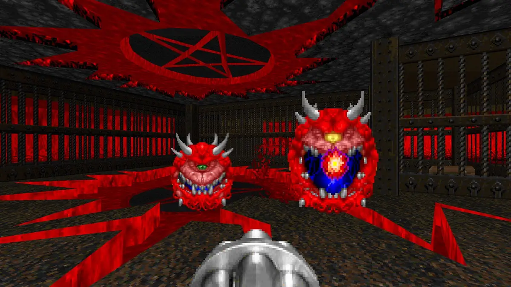

# Doom Engine 
Doom like Engine made in Rust using SDL2.

I started this project in order to learn Rust, so I'm probably not using the best practices and recommendations for the language.

Based on the video made by [The Old School Coder](https://www.youtube.com/watch?v=p7f9p9nDsmc), so the credit for the implementation goes all to him.
